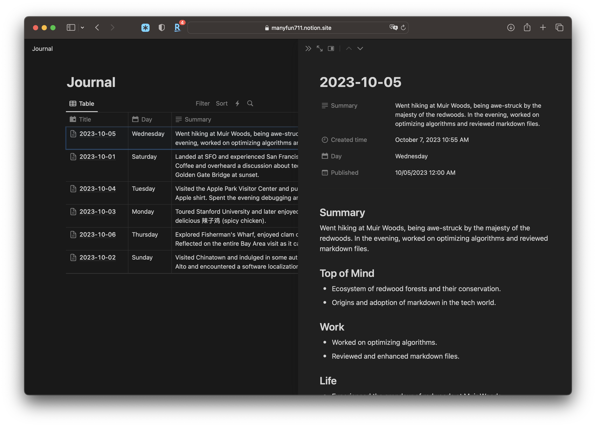

# The ALog App Helper

## Context

[ALog](https://apps.apple.com/us/app/alog/id6451082482) is an app that allows user to convert their audio clips into notes. The voiceover is based on OpenAI's Whisper API. User can also summarize their notes at the end of day with a given prompt. Besides, user can export their notes and summaries in the app. 

This repo contains two major helper scripts empowering the ALog app. 

- daily_markdown_generator.py: converting the summaries and notes from Backup folder into daily note in markdown in `Daily` folder.
- notion_markdown_importer.py: import the daily markdown files to a notion database.

## Usage

Please use the prompt in this repo for smooth experience to generate your daily summary. I have provided a sample summaries and notes under Backend folder.

1. Export your summaries in the markdown format, and put it under `Backup`` folder.
2. Export your notes in the CSV format, and put it under `Backup`` folder
3. Run `python3 daily_markdown_generator.py` to convert the summaries and notes into daily markdown.
4. Run `python3 notion_markdown_importer.py` to upload markdown in `Daily` folder to notion. Duplicate this [notion template](https://manyfun711.notion.site/1270788bb2514e579f597c5711086ea7?v=db9aa14313f9440bb8c8f177a39f8a41&pvs=4) and configure your NOTION_TOKEN and DATABASE_ID in `notion_markdown_importer.py`. See README of the file for more detailed usage.

## Credits

- The open source app [ALog](https://github.com/duxins/alog).
- Thanks to [@onenewbite](https://twitter.com/onenewbite) for his video "[为什么你应该开始用ChatGPT写日记|做笔记](https://www.youtube.com/watch?v=ZRv0Z-M7NqM)".

## License

Distributed under the GNU General Public License v2.0. See [LICENSE](./LICENSE) for more information.

**Important Note:** This open-source license does not prevent anyone from renaming and repackaging this app for distribution. However, doing so is in direct violation of App Store Review Guidelines, specifically Guideline 4.1 (Copycats) and Guideline 4.3 (Spam). Any attempt to simply rename and repackage this app for submission to the App Store is explicitly prohibited.